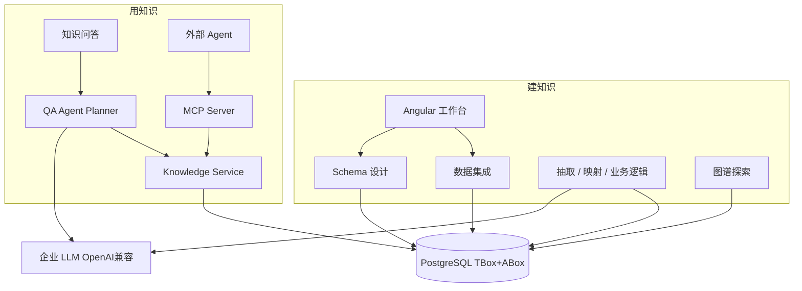
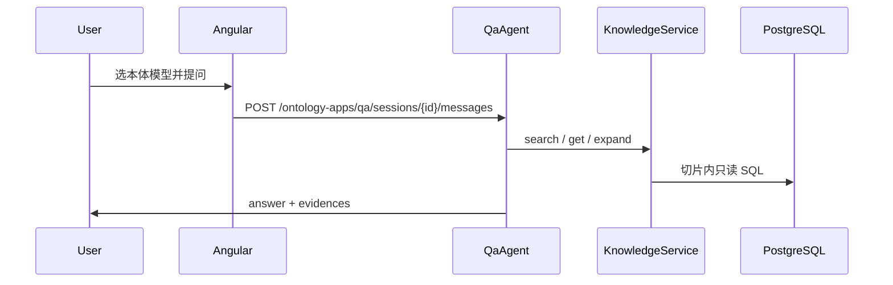

# KnowMind：从数据到本体应用

## 与现状的关键对齐

当前仓库的知识事实源是 **PostgreSQL 关系表**（TBox：`ontology_schema` / `ontology_class` / `ontology_property`；ABox：`ontology_instance` / `instance_data_value` / `instance_relation`）。`ontology_model` 是命名指针：`(schema_id, schema_version)`，问答与 MCP **只绑定模型切片，不扫全库**。图谱是 SQL 组装的 `{nodes, links}`（[graph_service.py](backend/app/services/graph_service.py)）。**没有 Jena/Fuseki/SPARQL 运行时**作为知识库；`rdflib` 仅用于 TTL 导入导出（[ttl_builder.py](backend/app/rdf/ttl_builder.py)）。LLM 走已有 `resolve_llm_provider` + OpenAI 兼容 `/chat/completions`。产品 UI **无登录**；MCP 可用环境变量 Key 或库内 `omk_` Key。

因此落地原则（与本体应用计划一致，并推广到全产品）：

- **不要把 Fuseki、向量库或图谱缓存做成第二 SoT**。建模写入 Postgres；探索、问答、MCP 一律读 Postgres（图谱可有 `graph_cache` 加速，失效后仍回表）。
- **建知识与用知识分层**：抽取/映射可以写 ABox；Knowledge Service / QA / MCP **只读**。
- **对外 SPARQL 若需要，只做受限子集门面**（已有 `POST /knowledge/sparql-subset`），禁止开放 UPDATE / 全表扫描。

---

## ① 总体技术架构

**产品定位**：KnowMind 是覆盖「数据接入 → Schema → 实例/逻辑抽取 → 图谱验证 → 问答与 MCP 应用」的工作台。侧栏四步快速上手对应：**业务数据集成 → Schema 抽取与设计 → AI 辅助抽取 → 本体应用**；图谱探索仍是验证手段，不是应用层终点。

**分层（必须遵守）**：

- **工作台层（Angular 20）**：Standalone + Signals；路由见 [app.routes.ts](frontend/src/app/app.routes.ts)
- **领域服务层（FastAPI）**：router → service → repository → ORM；统一 `AppError` JSON
- **知识能力层（仅应用）**：意图规划、tool loop、答案生成、溯源（[qa/agent.py](backend/app/qa/agent.py)）
- **本体知识访问层 `KnowledgeService`**：问答与 MCP **禁止直连 DB**
- **知识存储层**：Postgres 15/16 + 可选后续 pgvector（`KNOWLEDGE_PGVECTOR`，默认关）
- **对象存储**：`StorageBackend` 抽象；本地目录或 MinIO

**核心不变量**：

| 概念 | 含义 |
|---|---|
| Schema | TBox，可 `draft` / 发布，带 `version` |
| ontology_model | 给应用选的「这一版 Schema + 该 version 的实例」 |
| 实例 | 带 `schema_version`，避免草稿 Schema 污染已发布切片 |
| Evidence | 问答/MCP 统一证据包，生成阶段禁止无证据补事实 |

**运行形态**：本地双进程（uvicorn `:8000` + `ng serve :4200`），不容器化。抽取任务当前为 **进程内 asyncio**；重启时孤儿 `pending/running` 会被标 `failed`。

---

## ② 业务数据集成

**目标**：把结构化表与非结构化文档变成后续 Schema/抽取的原料，而不是知识库本身。

**结构化**（[db_source_service.py](backend/app/services/db_source_service.py)）：PostgreSQL / MySQL / GaussDB 连接；密码 Fernet 加密；`sqlalchemy.inspect` 反射表；表多选进入映射。连接失败可重试。

**非结构化**（[file_service.py](backend/app/services/file_service.py)）：上传、转标准 MD / 本体 MD、构建表 SQL → `ontomind_generated` 物化后可当结构化表。文本抽取已接常见类型（txt/md/pdf/docx 等），并清理历史占位 `extracted_text`。

**前端**：`/data/structured`、`/data/unstructured`。

**边界**：解析质量依赖文件本身；超大文档/复杂版式不是第一期保证范围。生成表走专用 schema，避免污染业务库。

---

## ③ Schema 抽取与设计 + 本体模型

**目标**：人机共创 TBox。AI 可从数据草稿类/属性，人工改完再发布。

**能力**：类、数据属性、对象属性（domain/range）、版本与发布状态；TTL 导入导出。实现见 [schema_service.py](backend/app/services/schema_service.py)。

**ontology_model**（[ontology_model_service.py](backend/app/services/ontology_model_service.py)）：问答、MCP、知识检索的 **绑定单元**。没有模型 ID，应用层拒绝「全库问答」。

**前端**：`/schema`；模型管理页同时承担 **LLM 配置**（`/models`）与本体模型列表（抽取/问答里选择）。

**难点**：中文 label 与 `local_name`/IRI 分离；发布后 ABox 必须钉住 `schema_version`，否则问答会读到草稿类。

---

## ④ AI 辅助抽取

**目标**：在 **已确认 Schema** 约束下写 ABox 与业务逻辑，而不是让模型自由造类。

**实例抽取**（[extraction_service.py](backend/app/services/extraction_service.py)）：非结构化走 LLM + SchemaSnapshot；结构化走字段映射 ETL（[mapping_service.py](backend/app/services/mapping_service.py)）。任务类型含抽取、清空实例等；状态机在 `extraction_task`。

**业务逻辑**：[business_logic_service.py](backend/app/services/business_logic_service.py) + 拓扑 [topology_service.py](backend/app/services/topology_service.py) / 画布工作区。

**LLM**：与问答共用 OpenAI 兼容客户端；抽取与问答需 **独立超时**（`QA_TIMEOUT_S` vs 抽取任务自身超时），避免互相拖死 worker。

**前端**：`/extraction/instances`、`/extraction/business-logic`。

**边界**：进程内任务不适合多 worker 水平扩展；下一阶段再外置队列。

---

## ⑤ 图谱探索

**目标**：验证 TBox/ABox，不是问答后端。

**实现**：`GET /graph?schema_id=&mode=schema|instance|mixed`；D3 力导向。可选 `graph_cache`。

**与应用层关系**：问答证据可跳图谱/实例；**禁止**问答直接把整图塞进 prompt。多跳只走 `KnowledgeService.expand_hops`（`max_hops≤3`，`max_nodes≤200`）。

---

## ⑥ 本体应用：知识问答与 MCP

详细设计仍以 [ontology_application_module 计划](ontology_application_module_6c3e0236.plan.md) 为准。此处只固定 **已落地契约**。

**Knowledge Service**（[knowledge/service.py](backend/app/knowledge/service.py)）：`get_schema` / `get_class` / `list_properties` / `search_instances` / `get_instance` / `list_relations` / `expand` / 可选 SPARQL 子集；`knowledge_access_log`。

**问答**：Schema 约束的 Query Planning（非 Text-to-SPARQL）。会话 `qa_session` / `qa_message`；MCP 调用的问答 `source=mcp`，产品历史列表过滤之。意图含 `lookup_entity` | `ask_attribute` | `ask_relation` | `multi_hop` | `schema_explain` | `chitchat_reject`。空证据必须「知识库中未找到」。

**MCP**：

- 协议：Streamable HTTP（Cursor `type: http`）挂在现网 FastAPI：`/api/v1/mcp`（及兼容 `/mcp/sse`、`/mcp/rpc`）；可选 stdio / 独立 SSE 端口
- Tools 全部转调 KnowledgeService（及 `ask_knowledge` → QaAgent）：`list_ontology_models`、`get_schema`、`get_class`、`list_properties`、`search_instances`、`get_instance`、`list_relations`、`expand_neighbors`、`ask_knowledge`
- URL `?ontology_id=` 绑定模型后，initialize `instructions` 声明可省略 `ontology_model_id`，tools/list 过滤为已登记服务的 `tool_names`
- 管理台：`/ontology-app/mcp` 管 API Key（明文仅创建时一次）与服务 CRUD（含编辑）

**MCP vs REST**：浏览器走 REST；IDE/外部 Agent 走 MCP。禁止 Agent 直连 Postgres。

---

## ⑦ 核心 API 地图

前缀均为 `/api/v1`。错误体：`{error:{code,message,field?}}`。

**建知识**

- `/db-sources`、`/files`：数据源
- `/schemas`、`/classes`、`/properties`：TBox
- `/mappings`、`/extraction/instances/*`、`/business-logic`、`/topology`：抽取与逻辑
- `/ontology-models`：应用绑定单元
- `/llm-models`：LLM 配置
- `/graph`、`/dashboard`：探索与首页统计

**用知识**

- `GET /knowledge/schema|instances|...`，`POST /knowledge/expand`，`POST /knowledge/sparql-subset`
- `/ontology-apps/qa/sessions` CRUD + `POST .../messages`
- `/mcp` Streamable HTTP；`/mcp/api-keys`、`/mcp/services` 管理（管理接口不走 MCP Key）

**MCP 输入约定**：除 `list_ontology_models` 外，未绑定时必填 `ontology_model_id`；`limit` 默认 20、最大 100。输出 `{ok, data, evidences, error}`。

---

## ⑧ 数据与模块分层

**后端包（已存在，勿再平行造一套）**

- `app/models` + `alembic/versions`（至 `010_qa_session_source`）
- `app/services/*`：建模/抽取/图谱/MCP 管理
- `app/knowledge/*`：只读知识出口
- `app/qa/*`：规划与生成
- `app/mcp/*`：协议、tools、Streamable HTTP、鉴权
- `app/ai/*`：LLM 与抽取流水线（`extract/` 目录为独立脚本，**产品路径不要改 extract/**）

**前端**：`features/data-integration`、`schema-studio`、`extraction`、`graph-explorer`、`ontology-app/{qa,mcp}`、`dashboard`、`llm-models`；共享 UI 对齐原型 tokens。

**不引入**：Jena/Fuseki、问答直连 SQL、第二套「知识图谱数据库」、在 MCP tool 里执行任意 SPARQL/SQL。

---

## ⑨ 技术选型（已定，变更需书面理由）

- 编排：自研 JSON plan + 最多 `QA_MAX_TOOL_STEPS`（默认 4）步；未绑 LangGraph
- LLM：OpenAI 兼容；规划/生成 JSON 约束
- 检索：Postgres `ILIKE` + 别名规范化 + 排序；pgvector 开关默认关
- MCP：官方 `mcp` SDK 可用于 stdio；HTTP 以自研 Streamable JSON-RPC 为准（Cursor initialize 必须走 POST）
- 前端：Angular 20，不引入第二套 SPA
- 部署：单 API 进程承载建模 + MCP HTTP，避免开发期再拆端口（独立 `MCP_PORT` 仍保留给 `--sse`）

---

## ⑩ 分阶段：已完成 vs 下一截

**已完成（可演示闭环）**

1. 数据集成 → Schema → 实例/逻辑抽取 → 图谱
2. Knowledge Service + 多轮问答（证据、拒答闲聊）
3. MCP 管理台 + Cursor Streamable HTTP + 本体 URL 绑定
4. 产品名 KnowMind；快速指引第四步改为本体应用

**阶段 H · 加固（建议下一期，约 5–8 日）**

- 目标：可给内网多人用，而不是单机演示
- 任务：可选登录或网关鉴权；MCP 生产强制 Key + 非 0.0.0.0 暴露策略；抽取任务队列（Redis/DB claim）避免多 worker 丢任务；黄金问答集回归（准确率、引用覆盖、空命中诚实率）
- 验收：重启不丢「可恢复」任务语义明确；无 Key 时远程 MCP 拒绝；问答不跨 `ontology_model_id`
- 依赖：现网 Postgres 与 LLM 配额

**阶段 V · 检索增强（可选）**

- pgvector 实例标签/属性 embedding；仍回写同一 Evidence 结构
- 验收：简称/编号召回优于纯 ILIKE，且不引入第二 SoT

**不做（除非单独立项）**

- 全量 SPARQL 端点、双写 RDF 库
- 用图谱服务替代 KnowledgeService
- 把 MCP 做成可写（创建实例/改 Schema）

---

## ⑪ 技术难点与风险

- 存储模型是表不是三元组库 → 强行 Fuseki 双写必漂
- 中文实体链接（简称、调度编号）→ 必须 Schema+实例词典，不能只靠 LLM
- 抽取与问答争用同一 LLM → 超时与并发上限必须分开配
- 无登录的 UI + 绑 `0.0.0.0` 的 MCP → 内网可被扫；默认 Key + 本机绑定
- `expand_hops` / 图谱 `limit` 爆炸 → 硬限制节点数
- `ontology_model` 与「当前 Schema 草稿」不一致 → 应用绑错 version 会「问不到刚抽的实例」

---

## ⑫ 最终推荐落地方案

**一条存储、两套出口、四个构建步、一个应用步。**

Postgres 是唯一知识事实源。建模链路负责把数据写成 Schema 与实例；图谱只做可视化校验；**Knowledge Service** 是问答与 MCP 的唯一读出口。外部 Agent 用 MCP Tools，工作台用 REST。新能力的扩展方式永远是：先加 KnowledgeService（或建模写入路径），再暴露 REST/MCP/Planner，而不是给某个客户端开后门 SQL。

MVP 已闭环。下一阶段优先 **鉴权、任务可靠性、评测**，而不是换存储或上全量 SPARQL。
