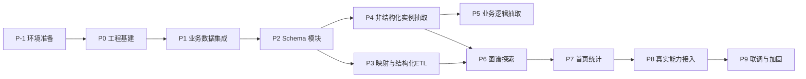

# OntoMind 项目开发规划（基线 v1）

> 本文是 OntoMind 的**排期与验收基线**，回答「做什么、按什么顺序做、做到什么程度算完」。
>
> 它不重复定义架构与数据契约——那是 [OntoMind-软件开发指导文档.md](OntoMind-软件开发指导文档.md)（下称「指导文档」，引用时写作 §x.y）的职责；也不重复定义交互与视觉——那是 [frontendUCD.html](frontendUCD.html)（下称「原型」）的职责。
>
> 三份文档的分工：**原型定「长什么样」，指导文档定「怎么建」，本文定「什么时候建、建完怎么验」。**

---

## 一、规划依据与现状快照

### 1.1 事实来源

| 事项 | 唯一事实来源 |
|---|---|
| 页面结构、文案、配色、图标名、字段名、按钮 | 原型 `frontendUCD.html` |
| 数据模型、DDL、状态机、API 契约、错误码、编码规范 | 指导文档 v2 |
| 里程碑、任务拆解、验收标准、工期 | 本文 |

冲突仲裁原则（沿用指导文档结尾约定）：**数据结构以指导文档为准，视觉与文案以原型为准**；无法调和的写 `TODO(spec-conflict)` 注释后继续推进，不阻塞进度。已识别的冲突见 §六。

### 1.2 原型规模清点

对原型做过一轮完整结构清点，作为工作量估算的依据：

- **7 个视图**：`view-home`、`view-structured`、`view-unstructured`、`view-schema`、`view-extract`、`view-biz-logic`、`view-graph`
- **4 个弹窗**：`db-modal`（7 字段）、`schema-class-modal`（4 字段）、`schema-prop-modal`（9 字段，含两组联动显隐）、`mapping-modal`（三栏 SVG 连线工作台）
- **约 40 个** `:root` 设计变量，**8 种**徽章变体（`b-success` / `b-warning` / `b-danger` / `b-neutral` / `b-accent` / `b-class` / `b-prop` / `b-inst`）
- **6 张数据表格**、**3 组分段控件**（seg-group）、**3 套 4 步向导**（step-card）
- **1 个 D3 力导向图**：17 节点 / 17 连线的示例数据，3 种 mode，缩放 0.3~3×，节点拖拽与点击详情

### 1.3 环境现状（Phase -1 已完成，实测记录）

| 组件 | 状态 | 说明 |
|---|---|---|
| Python | **3.12.10** 已装 | winget 用户级安装至 `%LOCALAPPDATA%\Programs\Python\Python312`，已排在 WindowsApps 占位程序之前 |
| pip | **25.0.1** | 随 Python 安装 |
| Node.js | **22.12.0** 已装 | 官方 zip 解压至 `D:\tools\node-v22.12.0-win-x64`，已写入用户 PATH。该版本正好落在 Angular 20 要求的 `^20.19 \|\| ^22.12 \|\| ^24` 区间 |
| npm | **10.9.0** | 随 Node 分发 |
| git | 已装，仓库已初始化 | `.gitignore` 已覆盖 `.venv` / `node_modules` / `.env` / `data/uploads` / `__pycache__` / `dist` |
| Python 虚拟环境 | `.venv` 已建 | 已装 `asyncpg 0.31.0` 用于数据库校验 |
| PostgreSQL | 远程，**已校验通过** | `172.25.58.24:5432`，版本 **15.12**（满足文档 15+）；`pgcrypto` 未装但当前账号可创建；`CREATE SCHEMA` 有权限。Clash Verge 已为 `172.16.0.0/12` 配置 DIRECT，VPN 开着也能连库，详见 §1.4 |

本机**无管理员权限**，因此全部采用用户级安装；本期**不容器化**，本地直接部署，数据库直连远程实例。

### 1.4 本机数据库连通性（已打通）

**根因**：Clash Verge（mihomo）以 TUN + fake-ip 全局模式接管默认路由。未配 DIRECT 时，`172.25.58.24` 落在未被排除的 `172.16.0.0/12` 私有段，流量进隧道后无法到内网，表现为「端口探测成功、Postgres 握手超时」。

**处置**：在 Clash Verge 订阅的前置规则中加入 `IP-CIDR,172.16.0.0/12,DIRECT,no-resolve`。处置后 `scripts/verify_db.py` 实测结果：

| 项 | 结果 |
|---|---|
| 连通性 | 已连接库 `postgres`，账号 `postgres` |
| 版本 | PostgreSQL **15.12**（文档要求 15+，满足；规划原文写「16」属表述偏差，以实测为准） |
| pgcrypto | **未安装**，但当前账号有 `CREATE EXTENSION` 权限（探测后已回滚） |
| CREATE SCHEMA | 有权限（探测 schema 已回滚） |

**对 Phase 0 的含义**：首个 Alembic 迁移必须以 `CREATE EXTENSION IF NOT EXISTS pgcrypto;` 开头——当前账号有权限，迁移本身即可完成安装，无需 DBA 介入。

---

## 二、阶段划分与依赖关系

**关键路径**：`P0 → P1 → P2 → P4 → P6`。

**可并行点**：P2 完成后，P3（确定性 ETL，不含 LLM）与 P4（LLM 抽取）互不依赖，两人协作时可并行。

**刻意的解耦点**：P8 的真实 LLM、真实文档解析、MinIO 接入**始终不阻塞**前面任何阶段——P2~P5 全程使用 `MockLLMProvider`，P1 的 `extracted_text` 先存占位文本。这是指导文档 §10.4 的设计意图，规划予以保留。

---

## 三、各阶段任务拆解与验收标准

### Phase -1 · 环境准备 · 0.5 人日 · 已完成

**任务**

1. 安装 Python 3.12、Node.js 22.12.0，确认 `python` / `pip` / `node` / `npm` 四条命令可用
2. `git init` 并落地 `.gitignore`
3. 产出 `.env.example`（对齐指导文档 §14 环境变量清单）
4. 远程 PostgreSQL 16 三项校验：asyncpg 连通性、`pgcrypto` 扩展、`CREATE SCHEMA` 权限

**验收标准**

- [x] 四条命令版本正确
- [x] `.gitignore` 经 `git check-ignore -v` 实测生效
- [x] `.env.example` 与 `.env` 已产出
- [x] 数据库校验脚本 `scripts/verify_db.py` 已就绪并实测（连接失败分支、密码脱敏均正常）
- [x] Clash Verge 配置 DIRECT 后四项校验通过（连通性 / 版本 15.12 / pgcrypto 可创建 / CREATE SCHEMA）

**为什么校验这三项**：`pgcrypto` 决定 §6 全部 12 张表的 `gen_random_uuid()` 主键默认值能否建立；`CREATE SCHEMA` 决定 §9.3「构建表 SQL → materialize-table」能否创建 `ontomind_generated`。这两项若缺失，会在 Phase 0 写完全部迁移后才暴露，返工成本高，所以提前到 Phase -1。

---

### Phase 0 · 工程基建 · 3 人日

**后端**

1. 按 §7.1 目录树创建全部空包：`core/ db/ models/ repositories/ schemas/ api/v1/routers/ services/ ai/ rdf/ storage/ tasks/`
2. `core/exceptions.py`：把 §7.4 错误码表落成 `ErrorCode` 枚举 + `AppError` 基类 + 全局异常处理器，统一输出 `ErrorResponse`。**这一步必须在写第一个业务接口之前完成**，否则各模块会各自发明错误格式
3. `schemas/common.py`：`PageResponse[T]`、`ErrorDetail`、`ErrorResponse`
4. ORM 模型覆盖 §6 全部 12 张表（含可选的 `graph_cache`），每张表统一追加 `created_by UUID NULL`
5. Alembic 首个迁移一次性覆盖全部 DDL，第一条语句为 `CREATE EXTENSION IF NOT EXISTS pgcrypto`
6. `core/config.py` 用 `pydantic-settings` 读取 `.env`

**前端**

1. `ng new frontend --standalone --style=scss --ssr=false`，加装 `d3`、`lucide-angular`
2. `styles/tokens.scss`：从原型 `:root` **1:1 迁移**约 40 个变量，不允许改值、不允许新造变量名
3. `app.routes.ts`：按 §11.3 建 7 条懒加载路由
4. App Shell：侧边栏（含两个可折叠分组 `group-data` / `group-extract`）+ 面包屑 topbar（`titleMap` 7 条）
5. 共享 UI 组件骨架：`button`、`badge`、`data-table`、`modal`、`seg-group`、`toolbar/search-box/filter-pill`、`action-menu`、`stat-card`、`pipeline-step`、`progress-bar`、`code-block`、`dropzone`、`empty-state`
6. `error.interceptor.ts`：捕获 `ErrorResponse`，`error.field` 非空时联动 `form.get(field)?.setErrors(...)`，复现原型 `data-invalid` 红框效果

**验收标准**

- 7 条路由可导航，侧边栏高亮与面包屑文案和原型逐字一致
- 后端 `/docs` 可打开，`alembic upgrade head` 与 `alembic downgrade base` 在远程库均可跑通
- `tokens.scss` 变量清单与原型 `:root` diff 为空

**风险提示**：`empty-state` 在原型中**不存在**（原型的空态是内联文本），需按现有视觉语言新建组件；徽章成功态的类名是 `b-success` 而非指导文档 §15.2 顺笔写的 `b-ok`，以原型为准。

---

### Phase 1 · 业务数据集成 · 5 人日

对应原型 `view-structured` + `view-unstructured`，指导文档 §8.1 / §8.2。

**后端**

- `/db-sources` 全部 7 个接口；`DbSourceService` 用 `sqlalchemy.inspect` 反射表结构写入 `data_source_table` / `data_source_table_column`
- `/files` 全部 11 个接口；`StorageBackend` 抽象 + `LocalStorageBackend` 实现
- `password_enc` 用 Fernet 加密，**任何 `Read` DTO 中不得出现该字段**（§7.6）
- 状态机严格执行：`DataSourceDB`（§5.3）、`DataSourceFile`（§5.2），非法转换在 Service 层拒绝

**前端 · 结构化页**

- 表格 8 列：连接名称 / 类型 / 主机端口 / 数据库名 / 表数量 / 状态 / 最近同步 / 操作
- `db-modal` 7 字段（名称、类型、主机、端口、库名、用户名、密码）
- 行内操作按连接状态分支：已连接态为「查看表 / 编辑 / 删除」，失败态首位换成「重试」
- 表清单弹窗多选 + 「确定选择」→ `PATCH /db-sources/{id}/tables/selection`

**前端 · 非结构化页**

- 表格 8 列含首列复选框；`more-vertical` 溢出菜单 6 项（转标准 MD / 转本体 MD / 重命名 / 编辑 / 构建表 SQL / 删除）
- 存储目标切换（本地 / MinIO）
- **补齐原型缺失行为**：拖拽区在原型中只有视觉、无任何 File API 绑定，此处需实现真实上传（含 `FILE_001` 类型校验、`FILE_002` 200MB 体积校验）

**本阶段边界**：`extracted_text` 存占位文本，真实的 PDF/DOCX 解析留到 P8。这样 P2 的 Schema 归纳可以立刻拿到「有内容的 ready 文件」跑通链路。

**验收标准**

- 新增连接后状态能自然流转到 `connected` 或 `failed`，失败时展示 `DB_SOURCE_001` 文案
- 上传文件后状态经 `pending → parsing → ready`，前端无需手动刷新即可看到终态
- 删除有关联数据的连接时级联行为符合 DDL 的 `ON DELETE CASCADE` 预期

---

### Phase 2 · Schema 模块 · 6 人日

对应原型 `view-schema` 的两个 tab，指导文档 §8.3。这是**单阶段接口数最多**的模块（15 个）。

**后端**

- Schema / Class / Property 三级 CRUD
- `POST /schemas/{id}/publish`：`version` 自增 + 写 `change_log`（§5.4）。注意**已发布不锁定编辑**，这是刻意简化，不要自作主张加只读约束
- TTL 导出：**必须**用 `rdflib.Graph().serialize(format="turtle")`，禁止手写字符串拼接
- TTL 导入：**必须事务化**（§9.2），用 `session.begin_nested()` 建 SAVEPOINT，任何一步失败整体回滚，不允许出现「导入了一半的类」
- `ttl_builder.py` 的**中文 label → 安全 IRI local name** 转换规则必须显式定义并配单元测试。这是最容易被含糊带过、又最容易在导出阶段炸掉的一处
- `DELETE /classes/{id}` 需校验实例引用，命中时报 `SCHEMA_004`

**前端 · 工作区 tab**

- 左侧数据源选择面板 + 「开始抽取」（接 `MockLLMProvider`）
- Schema 下拉、类 chip 列表（每个 chip 带属性计数 `.cnt`）、属性表 6 列
- `schema-class-modal` 4 字段；`schema-prop-modal` 9 字段，含两组联动：`kind=data` 显示 datatype、`kind=object` 显示 range class；`source=ai` 才显示 confidence

**前端 · 管理 tab**

- 搜索 / 导入 TTL / 新建 / 刷新 + 5 列表格 + 空态行

**验收标准**

- 导出的 TTL 能被 `rdflib` 重新解析，且「导出→导入→再导出」两次产物语义等价（往返测试）
- 故意上传语法错误的 TTL，返回 `SCHEMA_003` 且**库中无任何新增行**（回滚验证）
- 中文类名（如「设备」「产线」）导出后的 local name 合法且稳定可复现

---

### Phase 3 · 字段映射 + 结构化实例抽取 · 5 人日

对应原型 `view-extract` 的 struct 分支 + `mapping-modal`，指导文档 §8.5 / §9.5。

**后端**

- `/mappings` 4 个接口；`GET /mappings/target-properties` 返回的列表**必须含伪属性「实例 URI」**（对应 `target_kind='instance_uri'`）
- `extraction_service.run_structured`：按 §9.5 分批 `LIMIT/OFFSET` 读源库，避免大表 OOM
- 依赖校验：未绑定 `instance_uri` → `MAPPING_001`；源列类型与目标属性 datatype 不兼容 → `MAPPING_002`

**前端**

- `mapping-modal` 三栏工作台：左侧源字段列表、中间 SVG 连线层、右侧目标属性下拉。点击源字段绘制虚线连线
- 4 步向导 + 进度条

**为什么把 P3 排在 P4 之前**：结构化 ETL **完全不含 LLM**，是确定性的。用它先跑通「异步任务表 + 进度轮询 + 状态机 + 依赖校验」这套框架，可以把框架 bug 和 LLM 输出不稳定这两类问题**分开排查**。等 P4 接入 Mock LLM 时，框架已经是可信的。

**验收标准**

- 一张 1 万行的源表能完整 ETL 完成，内存占用平稳，`progress` 单调递增至 100
- 缺 `instance_uri` 绑定时前端在保存映射一步就报 `MAPPING_001`，不进入抽取

**风险**：`mapping-modal` 的 SVG 连线在原型中是原生 DOM 操作，迁移到 Angular 需重写为响应式绘制（连线坐标随滚动 / 窗口变化重算）。这是全项目**最容易超期的单点**，估算中已单列 2 人日。

---

### Phase 4 · 非结构化实例抽取 · 4 人日

对应原型 `view-extract` 的 unstruct 分支，指导文档 §8.4 / §2.3。

**后端**

- `asyncio.create_task` + `extraction_task` 表持久化 + 前端轮询（§2.3 时序图）
- `ExtractionTask` 状态机（§5.1）：**「重新抽取」= 新建一条 task 行**，禁止实现 `failed → running` 的原地回退，失败任务保留作审计
- 重复触发进行中任务 → `TASK_002`

**前端**

- 4 步 step-card 向导；真实进度条（300~500ms 轮询）
- 抽取结果统计 mini-bar；实例预览表 5 列 + 置信度徽章（≥90 绿 / 70~89 黄）
- **新增原型没有的「实例详情弹窗」**：指导文档 §8.4 要求 `GET /instances/{id}`，标注触发点为「实例详情弹窗 / 图谱节点点击」，但原型只有图谱右侧的详情面板、没有这个弹窗。需按图谱详情面板的视觉语言新设计

**验收标准**

- 抽取过程中刷新页面，进度能从数据库恢复继续展示（状态持久化在表里，不在内存里）
- 单个文件解析失败不影响同批次其他文件，任务整体仍可 `succeeded`，`output_summary` 体现「成功 N / 失败 M」（§10.3 第 3 条）

---

### Phase 5 · 业务逻辑抽取 · 2.5 人日

对应原型 `view-biz-logic`，指导文档 §8.6 / §15.1。

- 后端：`/extraction/business-logic` + 规则查询 / 导出；前置校验 `BIZLOGIC_001`（Schema 下至少 1 条 instance 作为实体锚点）
- 前端：4 步向导、深色 JSON 预览块、复制 JSON、导出文件
- 输出结构**严格对齐 §15.1**，`causality` 与 `constraint` 两种 `rule_type` 的字段集不同（前者有 `consequence`，后者有 `action_required` + `severity`）

**验收标准**：Schema 下无实例时点击抽取，返回 `BIZLOGIC_001` 且前端展示原文文案「请先完成本体实例抽取，再进行业务逻辑抽取」。

---

### Phase 6 · 图谱探索 · 4 人日

对应原型 `view-graph`，指导文档 §8.7 / §9.4。

**后端**

- `graph_service` 按 §9.4 组装 `{nodes, links}`，三种 mode 的节点/边过滤规则见指导文档
- **空数据返回空数组，不报错、不 404**（§2.2 明确要求，容易被误实现为报错）
- 默认 `limit=500`，超出时前端提示「数据量较大，建议按 Schema 缩小范围」

**前端**

- `d3-force-graph.component.ts` 移植原型 `renderD3Graph()` / `showNodeDetail()`
- 力参数（link distance 60/50/120、charge -200、collide 40/30/25/20）与配色从 `tokens.scss` 读取，不硬编码
- 节点详情面板按 4 种节点类型分支渲染字段
- **补齐原型缺失行为**：节点搜索框（原型无 JS 绑定）、缩放按钮（原型仅支持滚轮）

**验收标准**：三种 mode 切换后节点数与 `/graph` 返回一致；空 Schema 下展示空态而非报错；从图谱点击类节点可跳转回 Schema 工作区并选中该类。

---

### Phase 7 · 首页统计 · 1.5 人日

对应原型 `view-home`。`/dashboard/summary` 4 张 stat-card、`/dashboard/activity` 最近动态、4 步 pipeline 跨视图跳转。

**排在此处的原因**：它聚合前面所有模块的数据，只有前面都做完，统计数字才有真实来源可校验——放在最前面做只能对着假数据自说自话。

---

### Phase 8 · 真实能力接入 · 4 人日

- `openai_compatible_provider.py`：强制 JSON 输出 + Pydantic 校验失败重试 2 次 + 单文件失败不影响批次（§10.3）
- `MinIOStorageBackend`
- 真实文档解析：`pypdf` / `python-docx`，替换 P1 的占位文本
- 「构建表 SQL」的真实表格检测算法

**接口不变原则**：本阶段**不应修改任何 API 契约或数据库结构**。如果需要改，说明前面阶段的抽象没做对，应回头修抽象而不是改契约。

---

### Phase 9 · 联调与加固 · 4 人日

- 按 §15.2 清单**逐视图**走查：表格列是否与 DDL 对应、每个 `data-lucide` 按钮是否都有接口调用、弹窗校验文案是否与 §7.4 错误码表一致、状态徽章取值是否与状态机一致、异步操作是否有进度与 toast
- pytest 重点覆盖四类：§5 状态机非法转换被拒绝、§2.2 依赖校验、§9.2 TTL 导入事务回滚、`ttl_builder` local name 规则
- 分页与限流收口；图谱缓存（§6.7，可选）；CORS 从 `*` 收敛为具体域名
- **孤儿任务清理**：服务启动时把残留的 `running` 任务置为 `failed`（见 §七风险）

---

## 四、工作量估算

| 阶段 | 人日 | 备注 |
|---|---:|---|
| P-1 环境准备 | 0.5 | 已完成 |
| P0 工程基建 | 3 | |
| P1 业务数据集成 | 5 | |
| P2 Schema 模块 | 6 | 接口数最多（15 个） |
| P3 映射 + 结构化 ETL | 5 | 含映射弹窗交互 2 人日 |
| P4 非结构化实例抽取 | 4 | |
| P5 业务逻辑抽取 | 2.5 | |
| P6 图谱探索 | 4 | |
| P7 首页统计 | 1.5 | |
| P8 真实能力接入 | 4 | 不含供应商联调的不确定性 |
| P9 联调与加固 | 4 | |
| **合计** | **39.5** | 单人串行；双人在 P3/P4 并行可压缩至约 34 |

---

## 五、里程碑与可演示节点

每个里程碑都要求**可独立运行、可对外演示**，而不是「代码写完了但要等下个阶段才能看」。

| 里程碑 | 覆盖阶段 | 可演示内容 |
|---|---|---|
| M1 骨架可跑 | P-1 ~ P0 | 七个页面可导航，数据库迁移在远程库落地 |
| M2 数据进得来 | P1 | 能接数据库连接、能传文档，两个管理页全功能 |
| M3 本体建得起 | P2 | 建类建属性、发布版本、TTL 导入导出往返 |
| M4 实例抽得出 | P3 ~ P4 | 结构化 ETL 与非结构化 AI 抽取双通路出实例 |
| M5 全链路闭环 | P5 ~ P7 | 业务规则 + 图谱可视化 + 首页统计，端到端演示 |
| M6 生产就绪 | P8 ~ P9 | 真实 LLM 与文档解析接入，测试与加固完成 |

---

## 六、已识别的原型 / 文档冲突及处置

按 §1.1 的仲裁原则先行处置，均在代码中留 `TODO(spec-conflict)` 注释：

| # | 冲突点 | 处置 |
|---|---|---|
| 1 | 图谱工具栏是「TTL 文件选择器」，但 `GET /graph` 按 `?schema_id=` 组织 | 改为 Schema 选择器（数据结构以指导文档为准） |
| 2 | §8.4 要求「实例详情弹窗」，原型无此弹窗 | 新设计，复用图谱右侧详情面板的视觉语言 |
| 3 | §15.2 提到 `empty-state` 与 `b-ok`，原型无 `.empty-state` 类、成功徽章实为 `b-success` | 类名以原型为准用 `b-success`；`empty-state` 作为新组件补建 |
| 4 | 侧边栏「非结构化」排在「结构化」之前，与 §0 参照表顺序相反 | 以原型为准 |
| 5 | 原型的上传拖拽区、各搜索框、筛选 pill、图谱搜索、批量下载、全选复选框均无行为 | 全部按后端接口的查询参数实现为真实功能，不保留「假控件」 |
| 6 | 原型的 Schema / TTL 选择器是 `.select-fake`（伪下拉，非原生 `<select>`） | 实现为真实下拉，保持视觉一致 |

---

## 七、主要风险与应对

| 风险 | 影响 | 应对 |
|---|---|---|
| **本机 VPN 隧道劫持数据库流量**（已发生，已解决） | 曾导致本机无法连库 | 见 §1.4：Clash Verge 前置规则 `IP-CIDR,172.16.0.0/12,DIRECT,no-resolve`；校验已通过 |
| **远程 Postgres 权限不足** | 若无 `pgcrypto`，§6 全部 DDL 的主键默认值失效；若无 `CREATE SCHEMA`，§9.3 建表功能不可用 | 已前置到 Phase -1 用 `scripts/verify_db.py` 校验；若确实缺权限，退路是主键默认值改由应用层生成 UUID、生成表落到默认 schema 加前缀 |
| **单进程 asyncio 任务** | 服务重启丢失进行中任务，`running` 状态永久悬挂，前端进度条卡死 | P9 增加启动时孤儿任务清理（`running` → `failed`）；§7.5 已保留平滑替换为 Celery/arq 的路径，表结构无需变更 |
| **映射弹窗 SVG 连线** | 全项目最复杂的交互组件，原型为原生 DOM 实现，Angular 化需重写 | 估算已单列 2 人日；实现时优先保证功能正确，动效可后置 |
| **结构化 ETL 跨库连接** | 源库由用户配置，可能网络不可达或大表 OOM | P3 就做好分批读取、连接超时、单批次异常不中断整体任务 |
| **中文 label 转 IRI local name** | 规则不明确会导致 TTL 导出产物不稳定、往返不等价 | P2 明确规则 + 单元测试覆盖，作为 P2 的硬性验收项 |
| **真实 LLM 输出不稳定** | JSON 结构不符导致抽取大面积失败 | 全程先用 Mock 跑通；真实接入时靠 Pydantic 校验 + 重试 2 次 + 单文件失败隔离（§10.3） |

---

## 八、贯穿全程的执行约定

1. **先立规矩再写业务**：§7.4 错误码枚举与 §12 编码规范必须在 Phase 0 落地，后续所有模块无条件遵守
2. **分层单向依赖**：`Router → Service → Repository → ORM`，Router 里不得出现任何 ORM 查询，Repository 不得 `import app.ai` / `app.storage` / `app.rdf`
3. **Service 只返回 DTO**：禁止把 SQLAlchemy ORM 对象直接返回给 Router
4. **时间一律 UTC**：代码中禁止 `datetime.now()`，一律 `datetime.now(timezone.utc)`，本地化是前端职责
5. **文案单一来源**：前端弹窗校验提示必须复用后端 `ErrorDetail.message`，不允许前端另写一套
6. **每阶段收尾对照 §15.2 清单**，不要攒到 P9 一次性走查

---

*基线 v1。实施过程中若发现本文的阶段划分与实际依赖冲突，以指导文档 §2 的依赖关系为准，并回头修订本文。*
